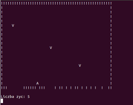

# Simply Space Invaders Game using OOP C++ and STL

## Introduction
It's simple console Space Invaders Game written using Oriented Object Programming C++ and Standard Template Library C++. I wrote this simple game to learn basics of OOP C++ and STL. I know it's looks terrible.

## Instalation on Linux
1. Download *src* folder
2. Open console *CTRL+ALT+T* (on Ubuntu)
3. Go to *src* folder with game using *cd*
4. Run *g++ *.cpp -o space_invaders*
5. Run *./space_invaders* file

## Keyboard keys
* **A** - left move
* **D** - right move
* **Spacebar** - shot
